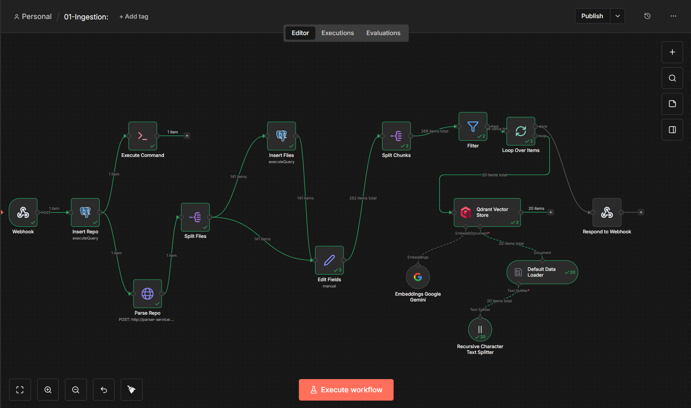
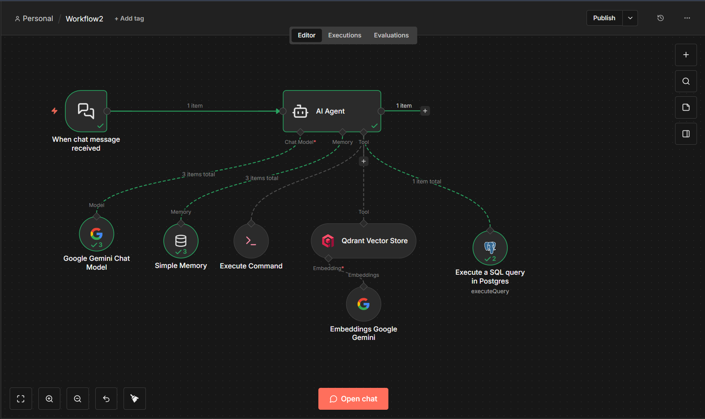
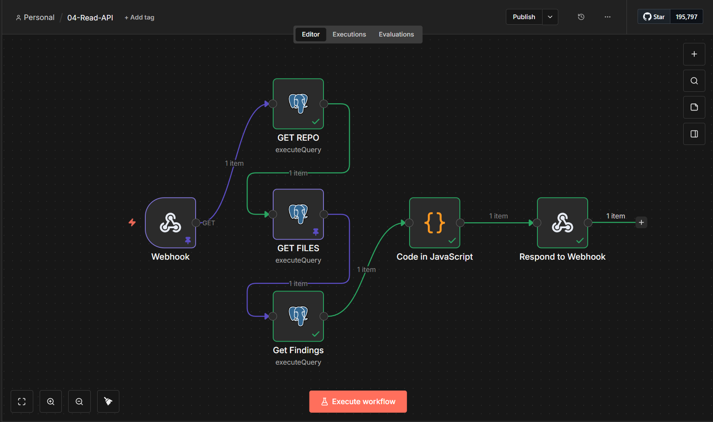

<div align="center">

# 🗺️ CodeAtlas

**An n8n-native AI codebase intelligence platform**

Point it at a GitHub repo. It ingests, chunks, and embeds the entire codebase into a vector store, then lets you *chat with your repo* through an AI agent — with a REST API to plug into any frontend.

[](https://n8n.io/)
[](https://qdrant.tech/)
[](https://www.postgresql.org/)
[](https://fastapi.tiangolo.com/)
[](https://www.docker.com/)
[](https://ai.google.dev/)

</div>

---

## What is this?

Most "chat with your codebase" tools hide the pipeline behind a single black-box script. CodeAtlas builds it instead as a set of **visual, inspectable n8n workflows** — every ingestion step, every embedding call, every SQL query is a node you can open and see running.

Feed it a repo URL, and it will:

1. Clone/pull the repo and parse it into structured file + metadata records
2. Chunk the source and push embeddings into **Qdrant**, with repo/file metadata mirrored in **Postgres**
3. Expose an **AI agent** that can reason over the codebase — searching the vector store, hitting Postgres directly, and running shell commands — through a chat interface
4. Serve a lightweight **REST API** for pulling repo/file/analysis data straight into the frontend

---

## Architecture

```
                  ┌────────────────────────────────────┐
                  │          GitHub repo URL           │
                  └────────────────────────────────────┘
                                     │
                                     ▼
                  ┌────────────────────────────────────┐
                  │           parser-service           │
                  │         (FastAPI, Python)          │
                  └────────────────────────────────────┘
                                     │  parsed files + metadata
                                     ▼
                  ┌────────────────────────────────────┐
                  │        n8n: 01 - Ingestion         │
                  │  clone -> parse -> chunk -> embed  │
                  └────────────────────────────────────┘
                                     │
                          ┌──────────┴────────┐
                          ▼                   ▼
                  ┌───────────────┐   ┌───────────────┐
                  │    Qdrant     │   │  PostgreSQL   │
                  │   (vectors)   │   │  (metadata)   │
                  └───────────────┘   └───────────────┘
                          └──────────┬────────┘
                                     ▼
                  ┌────────────────────────────────────┐
                  │        n8n: AI Query Agent         │
                  │       Gemini + Simple Memory       │
                  │     Qdrant + SQL + shell tools     │
                  └────────────────────────────────────┘
                                     │
                                     ▼
                  ┌────────────────────────────────────┐
                  │         n8n: 04 - Read API         │
                  │    webhook -> SQL reads -> JSON    │
                  └────────────────────────────────────┘
                                     │
                                     ▼
                  ┌────────────────────────────────────┐
                  │              frontend              │
                  │ Next.js 15, React 19, TailwindCSS  │
                  │         dark / teal theme          │
                  └────────────────────────────────────┘
```

---

## The workflows

### 🔹 01 — Ingestion

Triggered by a webhook `POST`. Registers the repo in Postgres, hands it to the parser microservice, then splits, chunks, and embeds every file before storing vectors in Qdrant.



| Node | Role |
|---|---|
| `Webhook` | Entry point, accepts repo POST payload |
| `Insert Repo` | Registers the repo in Postgres |
| `Execute Command` | Shells out to clone the repo |
| `Parse Repo` | Calls the FastAPI parser microservice |
| `Split Files` | Fans out per-file items |
| `Insert Files` | Persists file records to Postgres |
| `Edit Fields` | Normalizes fields before chunking |
| `Split Chunks` → `Filter` → `Loop Over Items` | Chunks content and iterates |
| `Default Data Loader` → `Recursive Character Text Splitter` | Prepares documents for embedding |
| `Embeddings Google Gemini` | Generates vector embeddings |
| `Qdrant Vector Store` | Writes embeddings to the vector DB |
| `Respond to Webhook` | Returns ingestion status |

### 🔹 AI Query Agent

A chat-triggered agent that reasons over the ingested codebase using three tools: vector search, direct SQL, and shell execution.



| Node | Role |
|---|---|
| `When chat message received` | Chat trigger |
| `AI Agent` | Orchestrates reasoning + tool calls |
| `Google Gemini Chat Model` | LLM backing the agent |
| `Simple Memory` | Conversation memory buffer |
| `Execute Command` (tool) | Lets the agent run shell commands |
| `Qdrant Vector Store` (tool) | Semantic search over embedded code |
| `Embeddings Google Gemini` | Embeds the query for vector search |
| `Execute a SQL query in Postgres` (tool) | Structured lookups against repo metadata |

### 🔹 04 — Read API

A thin, read-only REST layer over Postgres for the frontend — repo info, file listings, and stored findings, assembled into a single JSON response.



| Node | Role |
|---|---|
| `Webhook` | `GET` entry point |
| `GET REPO` | Fetches repo record |
| `GET FILES` | Fetches file records |
| `Get Findings` | Fetches analysis/findings records |
| `Code in JavaScript` | Merges the three results into one payload |
| `Respond to Webhook` | Returns the combined JSON |

---

## Tech stack

| Layer | Tool |
|---|---|
| Orchestration | n8n (self-hosted via Docker) |
| Parsing | FastAPI (Python) |
| Vector store | Qdrant |
| Relational store | PostgreSQL |
| Embeddings + LLM | Google Gemini |
| Frontend | Next.js 15, React 19, TailwindCSS, Framer Motion |
| Infra | Docker Compose |

---

## Project structure

```
CodeAtlas/
├── frontend/             # Next.js 15 UI, dark/teal design system
├── parser-service/       # FastAPI microservice — clones & parses repos
├── sql/                  # Postgres schema / init scripts
├── Dockerfile.n8n        # custom n8n image
├── docker-compose.yml    # n8n + Qdrant + Postgres + parser-service
└── README.md
```

---

## Running it locally (Local Quickstart)

1. **Clone the repository**
   ```bash
   git clone https://github.com/marbo786/CodeAtlas.git
   cd CodeAtlas
   ```

2. **Configure Environment**
   Copy `.env.example` to `.env` and fill in your keys:
   ```bash
   cp .env.example .env
   ```
   *Note: Ensure `PARSER_API_KEY` is set securely. The `N8N_BASE_URL` should point to your orchestrator.*

3. **Start the Infrastructure**
   Spin up n8n, Qdrant, Postgres, and the parser service:
   ```bash
   docker compose up -d
   ```

4. **Setup Orchestrator (n8n)**
   - Open n8n at `http://localhost:5678`
   - Import `workflows.json` into n8n.
   - Configure credentials for:
     - PostgreSQL (`codeatlas_db`, `codeatlas_admin`, etc.)
     - Qdrant (URL: `http://qdrant:6333`)
     - Google Gemini API Key
   - Ensure the webhook URLs match your `.env`:
     - Ingest webhook: `/webhook/ingest`
     - Read API webhook: `/webhook/read-api`
     - Chat webhook: `/webhook/.../chat`

5. **Start the Frontend**
   ```bash
   cd frontend
   npm install
   npm run dev
   ```

6. **Verify System**
   - Open `http://localhost:3000`
   - Paste a public GitHub URL (e.g., `https://github.com/expressjs/express`) into the Hero input.
   - You should see n8n workflows trigger, and Postgres populate with `repos` and `files` records.
   - Check Qdrant collections to verify vector embeddings were stored.
   - If ingestion fails, check Docker logs: `docker compose logs parser-service` or n8n execution history.

---

<div align="center">

Built by [Marbo](https://github.com/marbo786) · [LinkedIn](https://linkedin.com/in/marbo123)

</div>
